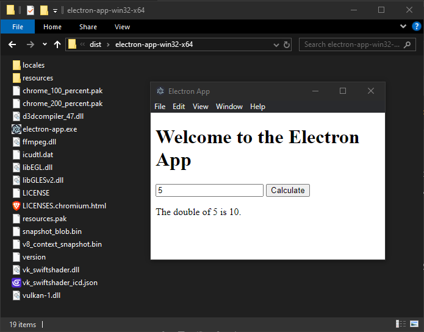

## Create JavaScript GUI Application (.exe) using Electron

No need to run `npm install` just,

1. install the electron-packager:
```bash
 npm install electron-packager  
```
2. package the app:
```bash
electron-packager . electron-app --platform=win32 --arch=x64 --out=dist --overwrite
```
### Running the Application
Double-click the .exe file in the dist directory to launch the GUI application.


